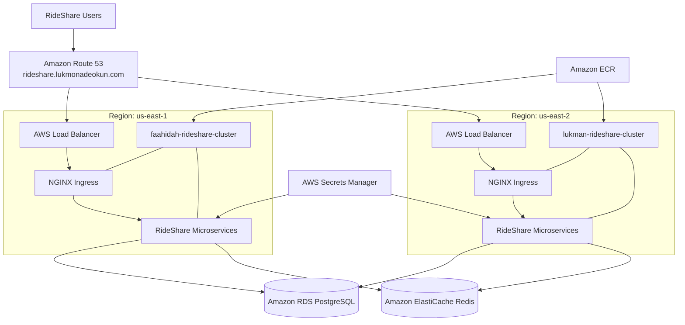

# Target-State Architecture

## Purpose

This document defines the Engineering Vision for the RideShare Platform upon
completion.

The target architecture builds upon the Engineering Baseline and evolves the
platform into a standardised, production-oriented, multi-region solution based
on Amazon EKS, managed AWS services, platform governance, automation,
observability and operational excellence.

Rather than describing the implementation journey, this document defines the
desired architectural end state that guides engineering decisions taken throughout the implementation journey

---

## Context

The RideShare Platform is being incrementally modernised rather than rebuilt.

The target architecture preserves the application's cloud-native,
microservices-based design while improving its operational maturity through:

- Standardised regional platforms
- Managed AWS services
- Regional resilience
- Platform automation
- Operational excellence

---

# Design Principles

The Engineering Vision is guided by the following principles.

## Standardisation

Platform components are deployed and configured consistently across all regions
to reduce configuration drift, simplify maintenance and improve operational
predictability.

### Managed Services

Stateful workloads are migrated to managed AWS services where appropriate,
allowing engineering effort to focus on application delivery rather than
database administration.

### Regional Resilience

Application workloads are deployed independently in multiple AWS regions to
improve service availability and reduce the impact of regional failures.

### Automation

Platform provisioning, deployment and operational workflows are automated to
improve consistency and reduce manual intervention.

### Operational Excellence

Monitoring, logging, operational procedures and platform governance are treated
as first-class engineering capabilities rather than afterthoughts.

---

# Architecture Overview

The target platform extends the existing single-region Kubernetes deployment
into a standardised multi-region architecture.

Stateless application workloads continue to run on Amazon EKS, while stateful
services transition from Kubernetes operators to managed AWS services.

Global traffic management distributes requests between regional Kubernetes
clusters, while supporting platform services provide secure application
delivery, deployment automation and operational visibility.

---

# Architecture Diagram

---

# Platform Architecture

## Compute Platform

The application is deployed across two standardized Amazon EKS clusters,
providing independent regional deployments with consistent platform
configuration.

## Application Platform

The RideShare application continues to follow a Kubernetes-native
microservices architecture.

Services remain independently deployable using Helm while sharing the same
platform standards, release process and deployment model across both regions.

Core application services include:

- Frontend
- Rider Service
- Driver Service
- Trip Service
- Matching Service
- Email Service

## Data Platform

Application state is provided through managed AWS services.

### PostgreSQL

- Amazon RDS
- Automated backups
- Automated patching
- Reduced operational overhead

### Redis

- Amazon ElastiCache
- Managed caching infrastructure
- Improved operational reliability

## Networking

Application traffic is managed through:

- Amazon Route 53
- Regional AWS Load Balancers
- NGINX Ingress Controllers
- Kubernetes Services

Route 53 directs requests to the most appropriate regional deployment based on
the configured routing policy and endpoint health.

## Security

Application secrets continue to be synchronized from AWS Secrets Manager using
External Secrets Operator.

TLS certificates remain managed by cert-manager.

Platform access follows AWS and Kubernetes security best practices.

## Deployment

Container images are stored in Amazon ECR.

Applications are packaged with Helm and deployed consistently to both regional
Amazon EKS clusters through standardized deployment workflows.

## Observability

The target platform incorporates centralized monitoring, logging and metrics
collection to improve operational visibility, troubleshooting and platform
health.

---

# Regional Architecture

## Regional Topology

### Primary Region

- AWS Region: us-east-2
- Cluster: lukman-rideshare-cluster

### Secondary Region

- AWS Region: us-east-1
- Cluster: faahidah-rideshare-cluster

Both regional deployments expose the same application hostname.

Amazon Route 53 determines which regional endpoint is returned according to the
configured routing and health-check policy.

## Global Platform Services

Global services supporting both regions include:

- Amazon Route 53
- Route 53 Health Checks
- Amazon ECR Cross-Region Replication
- AWS Secrets Manager
- CI/CD deployment pipelines

## Shared Managed Services

Application data services are provided by:

- Amazon RDS for PostgreSQL
- Amazon ElastiCache for Redis

## Regional Kubernetes Platform

Each Amazon EKS cluster provides the same platform capabilities, including:

- NGINX Ingress Controller
- cert-manager
- External Secrets Operator
- Metrics Server
- Cluster Autoscaler
- Amazon EBS CSI Driver
- Identical namespaces
- Identical Helm releases
- Consistent application versions

## Target Request Flow

1. Users access **rideshare.lukmonadeokun.com**.
2. Amazon Route 53 evaluates routing policies and regional endpoint health.
3. DNS resolves to the selected regional load balancer.
4. NGINX Ingress routes traffic to the appropriate RideShare service.
5. Application services communicate with Amazon RDS and Amazon ElastiCache.
6. If a regional endpoint becomes unhealthy, Route 53 redirects traffic to the healthy deployment according to the configured routing policy.

---

# Engineering Evolution

The Engineering Vision extends the Engineering Baseline by introducing:

- A standardised two-region deployment model
- Amazon RDS for PostgreSQL
- Amazon ElastiCache for Redis
- Global DNS-based traffic management
- Platform standardization
- Deployment automation
- Operational maturity

The implementation strategy for achieving this architecture is defined in the
Platform Evolution Roadmap and supported by the Architecture Decision Records
(ADRs).

---

# Related Documents

- [Current-State Architecture](../current-state/README.md)
- [Platform Evolution Roadmap](../platform-evolution-roadmap/README.md)
- [Architecture Decision Records (ADRs)](../decisions/README.md)
- [Platform Standards](../../../platform/README.md)
- [Cloud Conventions](../../../platform/cloud-conventions.md)