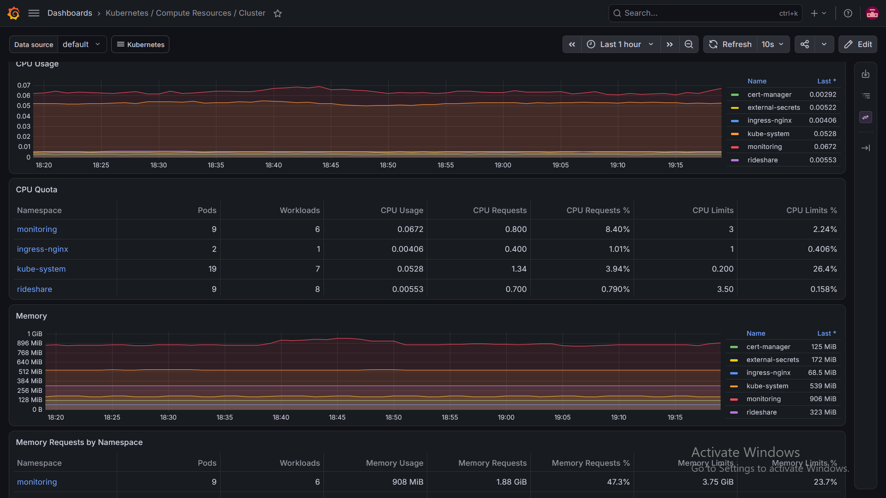
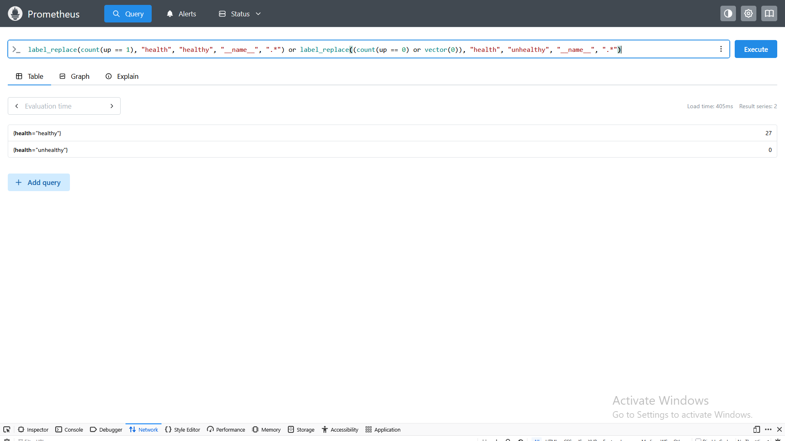
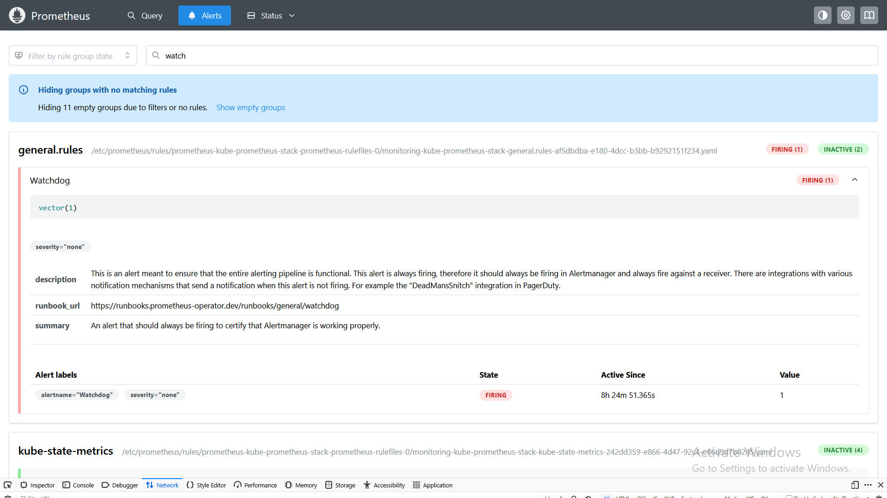

# use2 (us-east-2) Monitoring Foundation Validation

## Overview

This record documents the deployment and validation of the initial monitoring
foundation in the `rideshare-prod-use2` Amazon EKS cluster.

The monitoring stack was deployed using the
`prometheus-community/kube-prometheus-stack` Helm chart.

## Deployment Details

| Item                        | Value                   |
| --------------------------- | ----------------------- |
| Cluster                     | `rideshare-prod-use2`   |
| AWS Region                  | `us-east-2`             |
| Namespace                   | `monitoring`            |
| Helm release                | `kube-prometheus-stack` |
| Chart version               | `88.6.3`                |
| Prometheus Operator version | `v0.93.1`               |
| Helm revision               | `1`                     |
| Deployment status           | `deployed`              |

## Components Deployed

The deployment includes:

* Prometheus;
* Alertmanager;
* Grafana;
* Prometheus Operator;
* kube-state-metrics;
* Prometheus Node Exporter; and
* the default Kubernetes recording and alerting rules.

AWS-managed EKS control-plane components that cannot be scraped directly from
inside the cluster were disabled:

* kube-controller-manager;
* kube-scheduler;
* etcd; and
* kube-proxy.

## Workload Placement

Prometheus, Alertmanager, Grafana, Prometheus Operator and kube-state-metrics
were scheduled on nodes labelled:

```text
workload-type=platform
```

The necessary toleration allows these workloads to run on platform nodes
tainted with:

```text
workload-type=platform:NoSchedule
```

Prometheus Node Exporter runs as a DaemonSet across all four Linux nodes:

* two platform nodes; and
* two application nodes.

The DaemonSet reported four desired, current, ready and available pods.

## Persistent Storage

The monitoring components use the EBS CSI-backed `gp3` StorageClass.

| Component    | Requested capacity | StorageClass | Status |
| ------------ | -----------------: | ------------ | ------ |
| Prometheus   |               20Gi | `gp3`        | Bound  |
| Grafana      |                5Gi | `gp3`        | Bound  |
| Alertmanager |                2Gi | `gp3`        | Bound  |

AWS verification confirmed that all three underlying EBS volumes were:

* volume type `gp3`;
* encrypted;
* attached and `in-use`; and
* provisioned in `us-east-2` Availability Zones.

The existing `gp2` StorageClass was not modified or replaced.

## Monitoring Validation

Prometheus reported:

| Check                                   | Result |
| --------------------------------------- | -----: |
| Total scrape targets                    |     27 |
| Healthy scrape targets                  |     27 |
| Unhealthy scrape targets                |      0 |
| Monitored Kubernetes nodes              |      4 |
| Node Exporter targets                   |      4 |
| RideShare pods observed                 |      9 |
| RideShare available deployment replicas |      8 |
| Provisioned Grafana dashboards          |     25 |

Prometheus, Alertmanager and Grafana passed their internal health checks.

Grafana successfully connected to Prometheus and provisioned the standard
Kubernetes, node, networking, CoreDNS, Alertmanager and Grafana dashboards.

## Alert Validation

The only firing alert was:

```text
Watchdog
```

`Watchdog` is intentionally configured to remain active. It provides a
continuous signal that can later be used to validate the complete alert
delivery pipeline.

No operational failure alerts were firing during validation.

## Security and Access

Grafana and Prometheus use internal `ClusterIP` services and were not exposed
through a public ingress.

Administrative access to Grafana was validated using Kubernetes port
forwarding and the generated password stored in the Kubernetes Secret. The
password is not stored in the repository.

## Visual Evidence

### Grafana Cluster Overview

The Grafana cluster dashboard displays CPU, memory, workload and pod metrics
collected from `rideshare-prod-use1`.



### Prometheus Target Health

Prometheus reported 27 healthy targets and no unhealthy targets.



### Alert Status

The only firing alert was the intentionally active `Watchdog` alert.




## Result

The `use2` (us-east-2) monitoring foundation was deployed successfully and passed its
initial infrastructure, storage, scheduling, metrics collection, dashboard and
alert-rule validation.

Phase 4 remains in progress. Remaining work includes:

* deploying and validating the monitoring stack in `use2`;
* adding application-specific ServiceMonitors and dashboards;
* configuring actionable alert routing and notification delivery;
* implementing centralized logging;
* defining service-level indicators and service-level objectives; and
* completing multi-region observability and SRE validation.
